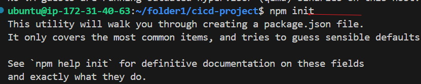

# Introduction to continous integration and continous deployment.
 This project work invloves the setting up a simple node.js web application, serving a static webpage and using github action as a CICD tool to run and deliver the web application.

 Pre-requisite:
 - Basic knowledge of version control concepts, comprising of git operation, clone, add, commit, push, and pull operations
 - Understandng Basic programming concepts, especially Node.js
 - Basic knowledge of Node.js and npm( node package manager). Ability to setup node.js and install dependencies using npm.
 - VS code text editor
 - CICD concept

 Practical implementation:
  Setting up the project
  1. Initialize a new repository on github
    - create a new repository on github
    
    - clone it to your local machine
    
  2. create a simple Node.js application
    - Initialize a Node.js project
    
    - create a simple server using express.
    js to serve a static web page
    
    - add your code to the repository and push to git hub
    
